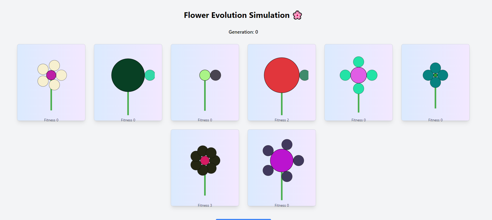
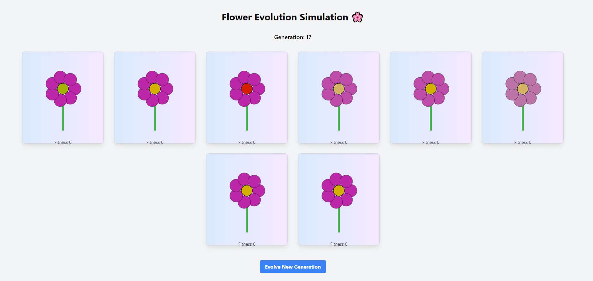

# Flower Evolution Simulation 🌸

## Project Overview
This project simulates the evolution of flowers using a **Genetic Algorithm (GA)**. Each flower is represented by a set of genetic traits (size, color, petal count, etc.), and over generations, the population evolves through selection, crossover, and mutation processes. The user can interact with the flowers by hovering over them, which increases their fitness and impacts the evolution process.

## Technologies Used
- **JavaScript (ES6)**: Core logic of the genetic algorithm.
- **React.js**: For building the front-end interface and managing state.
- **Konva.js**: For rendering flowers using an SVG-like environment on canvas.

---

## Classes and Key Functions

### 1. `Flower` Class
The `Flower` class represents the individual flowers in the population. Each flower has a set of genetic attributes (genes), which determine its appearance and fitness level.

#### Key Attributes (Genes):
- **centerSize**: The size of the flower's center.
- **centerColor**: The RGB color of the center of the flower.
- **petalColor**: The RGB color of the petals.
- **petalCount**: The number of petals on the flower.
- **fitness**: A numerical value that increases as the user hovers over the flower, representing how "fit" or "healthy" the flower is.

#### Key Methods:
- **constructor()**: Initializes the flower with random values for each genetic attribute. The fitness is set to `0` initially.
- **toString()**: A utility method to output the flower’s current genetic values as a string for debugging or display purposes.

### 2. `GeneticAlgorithm` Class
The `GeneticAlgorithm` class manages the entire process of evolving the flower population using selection, crossover, and mutation.

#### Key Attributes:
- **flowers**: An array representing the population of flowers.
- **mutation_rate**: The probability of random mutations occurring in the genes.
- **crossover_rate**: The probability of crossover between two parent flowers during reproduction.

#### Key Methods:
- **select()**: Returns the fittest `n/2` flowers (where `n` is the population size) based on their fitness values. These flowers are duplicated to maintain the population size.
  
- **crossover(Flowers)**: Takes as input an array of flowers and combines the genetic material of selected parent flowers to create new offspring. The crossover rate controls how frequently crossover occurs, and a portion of the population is left unchanged to maintain diversity.

- **mutate(offsprings)**: Takes as input what the crossover returns and introduces random changes (mutations) to the genes of some flowers in the population. This helps ensure genetic diversity and prevents premature convergence on a single solution. The mutation is applied based on the mutation rate and random gene selection.

- **evolve()**: The main function that orchestrates the selection, crossover, and mutation processes for each generation. It updates the flower population by applying these processes in sequence.

### 3. `FlowerCard` Component
This is a React component responsible for rendering each individual flower on the UI. The component displays the flower’s appearance based on its genetic attributes and tracks its fitness.

#### Key Props:
- **dna**: The genetic attributes of the flower passed from the `Flower` class.
- **hoverTime**: Tracks how long the user hovers over the flower, which directly impacts its fitness.

#### Key Methods:
- **handleMouseEnter()**: Starts a timer that increases the flower’s fitness as long as the user’s mouse hovers over the flower.
- **handleMouseLeave()**: Stops the fitness increase when the user moves the mouse away from the flower.

### 4. `App` Component
The `App` component is the main entry point for the application. It handles initializing the population, triggering the evolution process, and rendering the flowers on the screen.

#### Key Methods:
- **handleEvolveGeneration()**: Triggers the genetic algorithm to evolve the population by calling the `evolve()` method on the `GeneticAlgorithm` instance. This causes the flowers to change based on the genetic algorithm processes (selection, crossover, mutation).

---

## Evolution Workflow

1. **Initialization**:
   - A population of flowers is randomly generated with varying genetic traits (center size, center/petal color, petal count).
   
2. **User Interaction**:
   - Users can hover over flowers. This interaction increases the flower’s fitness over time. The longer a flower is hovered on, the fitter it becomes.

3. **Selection**:
   - The genetic algorithm selects the fittest `n/2` flowers based on their fitness values and duplicates them to maintain the population size.

4. **Crossover**:
   - Pairs of selected parent flowers are combined to produce new offspring. Offspring inherit some traits from each parent, leading to genetic diversity.

5. **Mutation**:
   - Random mutations are introduced to some flowers' genes to maintain diversity and avoid premature convergence.

6. **Evolution**:
   - The population is updated with a new generation of flowers, and the process repeats.

---

## Results and Snapshots

### Initial Population

### Evolved Population after 17 Generations

## Team Members and Contributions

| Name             | Tutorial                | Contribution                                        |
|------------------|---------------------|-----------------------------------------------------|
| **Ahmed Labib**   | 11      | Developed the genetic algorithm and integrated it with the front-end. |
| **[Team Member 2]** | Front-end Developer | Implemented the visual rendering of the flowers.     |
| **[Team Member 3]** | State Manager      | Managed state handling and ensured smooth interaction. |
| **[Team Member 4]** | Tester/Optimizer   | Assisted in testing and performance optimizations.   |

